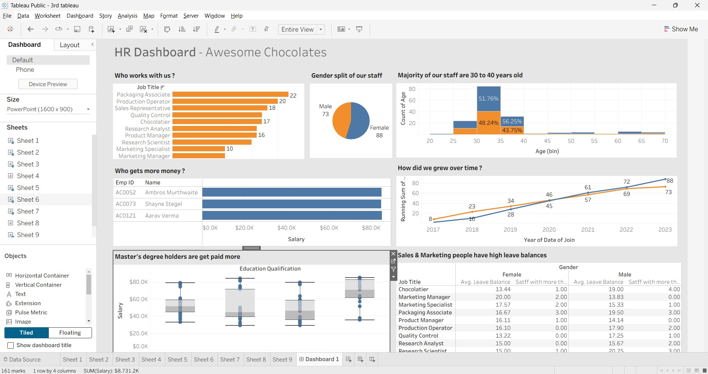

# HR Analytics Dashboard - Awesome Chocolates

## 📌 Project Overview

This Tableau project provides an HR analytics dashboard for analyzing employee demographics, job roles, salary distribution, education qualifications, employee growth, and leave balances.

The dashboard helps understand workforce composition and identify relationships between employee education, salary, job roles, age, gender, and leave patterns.

## 🎯 Business Objective

The objective of this project is to provide an interactive view of the workforce and support HR decision-making through analysis of employee demographics, compensation, hiring trends, education levels, and leave balances.

## 📊 Dataset

The project uses the `hr-data-analysis (1).xlsx` dataset containing employee-level HR information.

### Dataset Details

* Total Employees: 161
* Female Employees: 88
* Male Employees: 73
* Job Titles: 10
* Education Qualifications: 4
* Joining Period: 2017–2023
* Average Salary: $54,231
* Average Age: 35.2 years
* Average Leave Balance: 16.4 days

### Key Fields

* Employee ID
* Name
* Gender
* Education Qualification
* Date of Join
* Job Title
* Salary
* Age
* Leave Balance

## 🛠️ Tools & Technologies

* Tableau
* Microsoft Excel
* Data Visualization
* HR Analytics
* Business Intelligence

## 📈 Dashboard KPIs & Analysis

### Workforce Composition

The dashboard shows a gender distribution of:

* Female: 88
* Male: 73

Packaging Associate is the largest job category with 22 employees, followed by Production Operator with 20 employees and Sales Representative with 18 employees.

### Employee Age Distribution

The majority of employees are between 30 and 40 years old.

* 30–35 years: 85 employees
* 35–40 years: 32 employees
* 25–30 years: 24 employees

This shows that the workforce is concentrated in the 30–40 age range.

### Salary Analysis

The three highest-paid employees shown in the dashboard are:

* Aarav Verma: $85,000
* Ambros Murthwaite: $84,800
* Shayne Stegel: $84,700

The analysis also shows a strong relationship between higher education qualifications and average salary.

Average salary by education level:

* Master's Degree: $67,038
* Bachelor's Degree: $53,882
* Diploma: $51,046
* High School Diploma: $48,905

### Employee Growth Over Time

Employee joining trends are analyzed from 2017 to 2023.

The number of employees joining each year is:

* 2017: 10
* 2018: 23
* 2019: 29
* 2020: 29
* 2021: 27
* 2022: 23
* 2023: 20

The highest number of employee additions occurred in 2019 and 2020.

### Leave Balance Analysis

The dashboard compares average leave balances across job roles and gender, with particular attention to Sales and Marketing roles.

The analysis helps identify differences in leave balances across employee groups.

## 🔍 Key Insights

1. The dataset contains **161 employees**, with females representing the larger group at 88 employees.
2. Employees aged **30–40 years** make up the majority of the workforce.
3. **Packaging Associate** is the largest job role with 22 employees.
4. Employees with a **Master's Degree have the highest average salary**, at approximately $67K.
5. The three highest salaries are all above **$84K**.
6. Employee additions peaked in **2019 and 2020**, with 29 employees joining in each year.
7. Salary varies considerably across education qualifications, with higher qualifications generally associated with higher average salaries.
8. Leave balances vary across job roles and gender, providing useful information for workforce and leave management.

## 💡 Business Recommendations

* Continue monitoring compensation differences across education levels and job roles.
* Review career progression opportunities for employees with higher qualifications.
* Monitor workforce composition across age groups and job functions.
* Use hiring trends to support future workforce planning.
* Analyze leave patterns across departments and roles to improve workforce availability planning.
* Monitor Sales and Marketing leave balances to identify potential staffing or workload concerns.

## 📷 Dashboard Preview



## 📁 Repository Structure

```text id="q1f4d8"
Tableau-HR-Analytics-Dashboard/
│
├── README.md
├── Github 3rd tableau.twbx
├── hr-data-analysis (1).xlsx
└── tableau dashboard.jpg
```

## 🚀 How to Use

1. Download or clone this repository.
2. Open `Github 3rd tableau.twbx` using Tableau Desktop.
3. Explore the interactive HR dashboard.
4. Use the dashboard views to analyze employee demographics, salaries, education, hiring trends, and leave balances.

## 👩‍💻 Skills Demonstrated

* Tableau Dashboard Development
* HR Analytics
* Data Visualization
* Employee Demographic Analysis
* Salary Analysis
* Education & Compensation Analysis
* Workforce Trend Analysis
* Leave Balance Analysis
* KPI Development
* Business Intelligence

